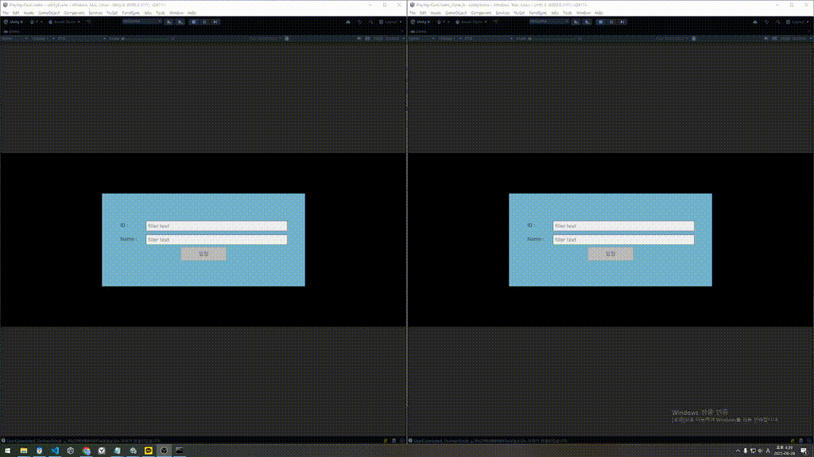

# Playing-Card-Game

* 이 README는 Google Gemini의 도움을 받아 작성되었습니다.

---

Unity로 제작된 멀티플레이어 블랙잭 카드 게임입니다.

## 🎮 게임 스크린샷



## 🌐 서버

**참고:** 이 프로젝트는 서버와 함께 실행해야 정상적으로 동작합니다.

이 게임을 실행하려면 별도의 서버 애플리케이션이 필요합니다. 아래 저장소에서 서버를 확인해주세요.

- **서버 저장소**: [Playing-Card-Game-Server](https://github.com/pjb24/Playing-Card-Game-Server.git)

## ✨ 주요 기능

- 실시간 멀티플레이어 블랙잭 기능
- 칩을 이용한 베팅 시스템
- 블랙잭 기본 규칙 구현 (Hit, Stand, Double Down, Split 등)

## 🛠️ 기술 스택

- **게임 엔진**: Unity `6000.0.41f1`
- **렌더 파이프라인**: Universal Render Pipeline (URP)
- **UI**: UI Toolkit
- **애니메이션**: DOTween

## 🚀 시작하기

이 프로젝트를 로컬에서 실행하려면 아래의 안내를 따라주세요.

### 필요 사항

- Unity Hub
- Unity `6000.0.41f1` 버전

### 설치 방법

1.  이 저장소를 클론합니다:
    ```sh
    git clone https://github.com/pjb24/Playing-Card-Game.git
    ```
2.  Unity Hub를 열고 'Add project from disk'를 선택하여 이 프로젝트 폴더를 추가합니다.
3.  Unity 에디터가 자동으로 패키지를 설치하고 프로젝트를 로드할 때까지 기다립니다.
4.  `Assets/Scenes/InitScene.unity` 씬을 엽니다.
5.  Unity 에디터의 플레이 버튼을 눌러 게임을 시작합니다.

## 📂 프로젝트 구조

- `Assets/Scenes`: 게임의 주요 씬(Lobby, Blackjack 등)이 포함되어 있습니다.
- `Assets/Scripts`: 게임 로직과 관련된 C# 스크립트가 들어있습니다.
- `Assets/Prefabs`: 재사용 가능한 게임 오브젝트(카드, 칩 등)가 저장되어 있습니다.
- `Assets/UI Toolkit`: UI 문서와 스타일시트가 포함되어 있습니다.
- `Assets/Materials`: 게임에 사용되는 머티리얼 파일이 있습니다.
- `Assets/Sprites`: UI 및 게임 요소에 사용되는 2D 스프라이트가 있습니다.